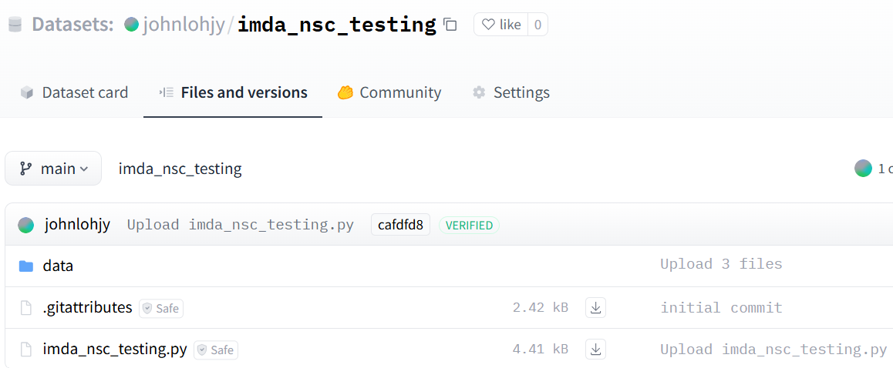

# Creating a HuggingFace Dataset Repo

### Step 1: Create a new dataset repository


### Step 2: Follow the instructions and run ```prepare_dataset.ipynb```

### Step 3: Upload the compressed files to the created dataset repository


### Step 4: Modify and upload the loading script. Note that it has to have the same name as the created HF dataset repo

Modify the paths in the loading script as needed



