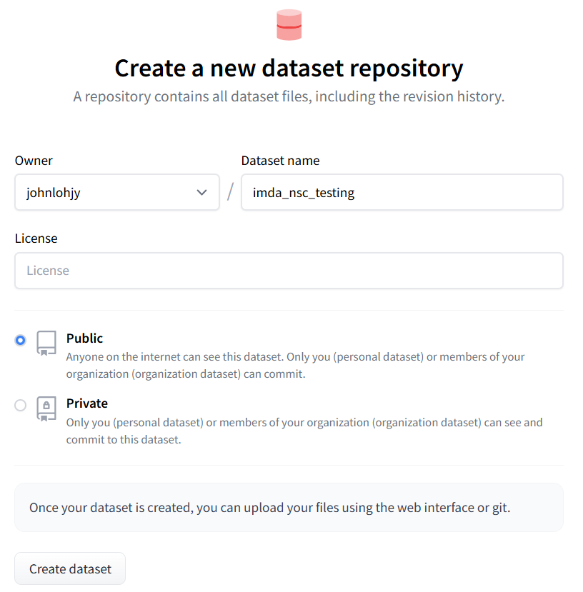

# File Directory

**Key Files**

```prepare_dataset_full.ipynb```: Prepare the dataset (whole of part 3 same close mic)

```prepare_dataset_full_split.ipynb```: Split the dataset (whole of part 3 same close mic) to train and test compressed files to be uploaded to HF

```prepare_dataset_small.ipynb```: Prepare a portion of the dataset (whole of part 3 same close mic in terms of hours) to be upload to HF

```imda_nsc_p3_same_closemic_train.ipynb```: Example dataset loading script to be uploaded to its respective HF dataset

```use_dataset_full_train.ipynb```: Example on how to stream from its respective HF dataset

<br/>
<br/>
<br/>

# Steps to use dataset

### Step 1: Refer to ```use_dataset_small_train.ipynb``` to see an example on how to stream 50 hours of training data

### Step 2: Refer to ```use_dataset_small_test.ipynb``` to see an example on how to stream 6 hours of test data

<br/>
<br/>
<br/>

# Dataset Links
**Main Dataset**:
- https://huggingface.co/datasets/johnlohjy/imda_nsc_p3_same_closemic_train
    - Full dataset for training. 500+ hours

- https://huggingface.co/datasets/johnlohjy/imda_nsc_p3_same_closemic_test
    - Full dataset for testing

**Others**:
- https://huggingface.co/datasets/johnlohjy/imda_nsc_p3_same_closemic_small_train
    - 50 hours of training data
- https://huggingface.co/datasets/johnlohjy/imda_nsc_p3_same_closemic_small_test
    - 6 hours of test data
- https://huggingface.co/datasets/johnlohjy/imda_nsc_p3_same_closemic
    - All data

<br/>
<br/>
<br/>

# Steps to create dataset <u>from scratch</u>

### Step 1: Create 2 HF dataset repositories: One for train data, One for test data



### Step 2: Follow the instructions in ```prepare_dataset_full.ipynb``` and run ```prepare_dataset_full.ipynb```

### Step 3: Follow the instructions in ```prepare_dataset_full_split.ipynb``` and run ```prepare_dataset_full_split.ipynb```

### Step 4: Upload the ```data-train``` folder created from Step 3 containing the train compressed files to the created train dataset repository

### Step 5: Modify and upload the loading script. Note that it has to have the same name as the created HF dataset repo.

Example: If your HF dataset repo is called ```imda_nsc_p3_same_closemic_train```, your loading script has to be called ```imda_nsc_p3_same_closemic_train.py```

Modify the paths in the loading script as needed
- _DATA_URL
- _PROMPTS_URLS
- ```train_dir``` as the relative paths of the compressed file may vary depending on how it was created 

### Step 6: Upload the ```data-test``` folder created from Step 3 containing the test compressed files to the created test dataset repository

### Step 7: Modify and upload the loading script. Note that it has to have the same name as the created HF dataset repo.

### Step 8: Refer to ```use_dataset_full_train.ipynb``` and ```use_dataset_full_test.ipynb``` on how to stream the train and test datasets