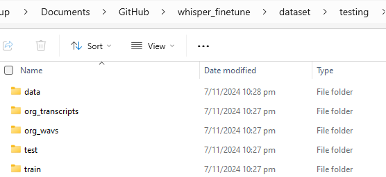
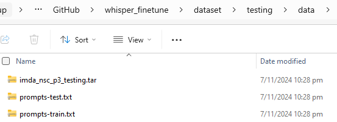
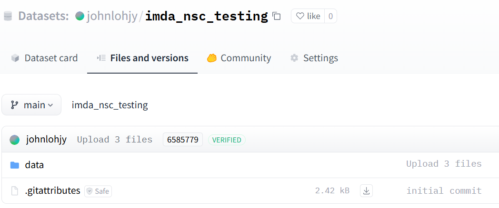
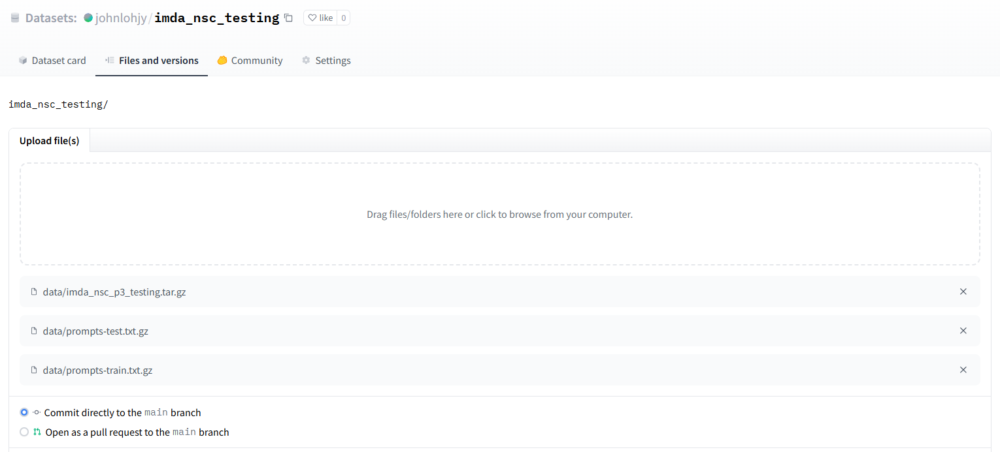
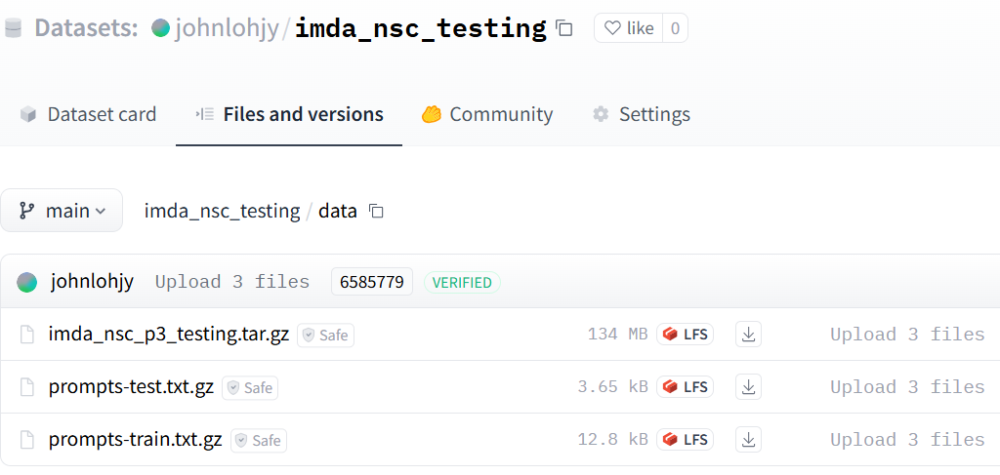
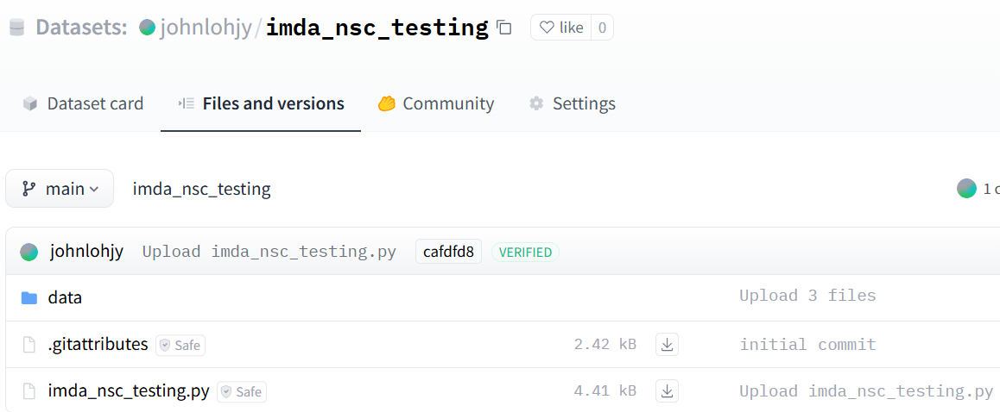

# File Directory

**Key Files**

```prepare_dataset.ipynb```: Prepare the dataset (whole of part 3 same close mic) to be uploaded to HF

```prepare_dataset_small.ipynb```: Prepare a portion of the dataset (in terms of hours) to be upload to HF

```imda_nsc_p3_etc.ipynb```: Dataset loading script to be uploaded to its respective HF dataset

```use_dataset_etc.ipynb```: Short example on how to stream from its respective HF dataset

<br/>
<br/>
<br/>

# Steps to use dataset

### Step 1: Refer to ```use_dataset_small_train.ipynb``` to see an example on how to stream 50 hours of training data

### Step 2: Refer to ```use_dataset_small_test.ipynb``` to see an example on how to stream 6 hours of test data

<br/>
<br/>
<br/>

# Dataset Links

- https://huggingface.co/datasets/johnlohjy/imda_nsc_p3_same_closemic_small_train
    - 50 hours of training data
- https://huggingface.co/datasets/johnlohjy/imda_nsc_p3_same_closemic_small_test
    - 6 hours of test data
- https://huggingface.co/datasets/johnlohjy/imda_nsc_p3_same_closemic
    - All data

<br/>
<br/>
<br/>

# Steps to create dataset <u>from scratch</u>

### Step 1: Create a new HF dataset repository


### Step 2: Follow the instructions in ```prepare_dataset.ipynb``` and run ```prepare_dataset.ipynb```

### Step 3: Upload the ```data``` folder created from Step 2 containing the compressed files to the created dataset repository











### Step 4: Modify and upload the loading script as needed. Note that it has to have the same name as the created HF dataset repo

Example: If your HF dataset repo is called ```imda_nsc_p3_testing```, your loading script has to be called ```imda_nsc_p3_testing.py```

Modify the paths in the loading script as needed



### Step 5: Refer to ```use_dataset_etc.ipynb``` on how to stream the dataset and its splits

### Step 6: Repeat Step 2 to Step 5, but use ```prepare_dataset_small.ipynb``` instead of ```prepare_dataset.ipynb```. 
- This is to use less hours of data as the original dataset has 500+ hours of training data
- By default, ```prepare_dataset_small.ipynb``` cuts it to 50 hours